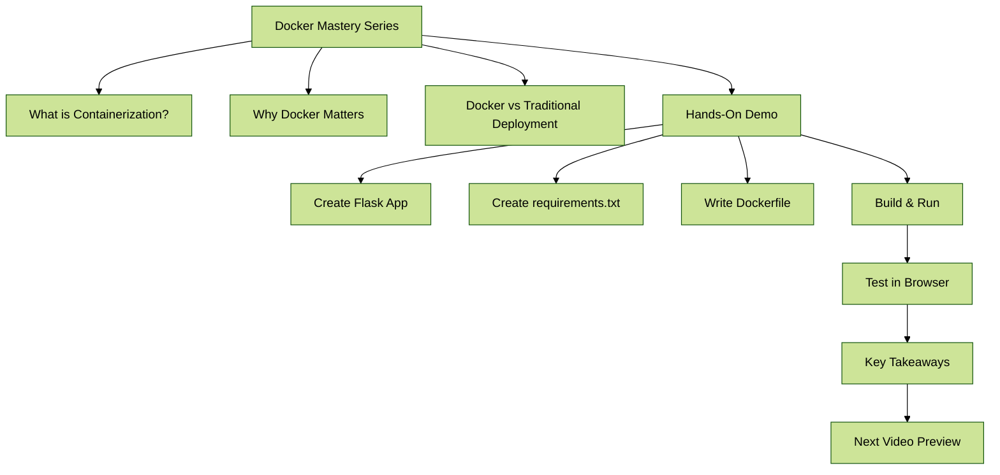

Video 1: Basic Web Application with Docker (Beginner)
Duration: 12-15 minutes
Intro (2 minutes)

Welcome to Docker mastery series
What we'll build: Simple Flask app in Docker
Prerequisites: Docker installed

Theory Section (3 minutes)

What is containerization?
- Think of it like packing your lunch: Everything you need (sandwich, chips, drink) in one neat box!
- Instead of food, we pack our application and all its dependencies
- No more "but it works on my machine" excuses 🍱

Why Docker matters
- Imagine if you could ship your entire kitchen to a friend, exactly as is
- Docker lets you package and ship applications the same way
- Your app runs the same everywhere - from your laptop to the cloud 🚢

Docker vs traditional deployment
- Traditional: Like moving to a new house and having to buy all new furniture
- Docker: Like living in a fully-furnished mobile home that works everywhere
- No more dependency drama or environment emergencies! 🏠

Hands-On Demo (8 minutes)
Step 1: Create Flask App (2 minutes)
python# app.py

```
from flask import Flask
app = Flask(__name__)

@app.route("/")
def home():
    return "Hello, Docker!"

if __name__ == "__main__":
    app.run(host="0.0.0.0", port=5000)
```

Step 2: Create requirements.txt (1 minute)
Flask


Step 3: Write Dockerfile (3 minutes)


dockerfileFROM python:3.9
WORKDIR /app
COPY requirements.txt .
RUN pip install -r requirements.txt
COPY . .
CMD ["python", "app.py"]


Step 4: Build & Run (2 minutes)

```bash

docker build -t flask-app .
docker run -p 5000:5000 flask-app
```


Wrap-up (2 minutes)

Test in browser: http://localhost:5000

Key takeaways
Next video preview

