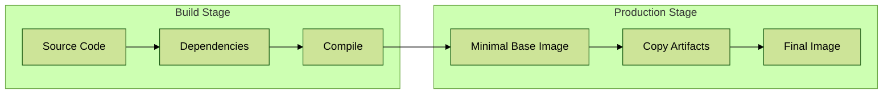

# Day 10: Multi-Stage Docker Builds - Making Your Production Apps Lighter and Faster



## Real-World Scenario
Imagine you're leading a team at a fast-growing startup. Your Flask application works great in development, but in production, you're facing issues:
- Your Docker images are massive (800MB+)
- Deployments are slow
- Cloud costs are rising due to large container sizes
- Security team is concerned about vulnerabilities in development dependencies

Let's solve these problems using multi-stage builds!

## Why This Matters
- 💰 Reduced cloud costs (smaller images = lower storage/bandwidth costs)
- 🚀 Faster deployments (smaller images download quicker)
- 🔒 Better security (fewer vulnerabilities in production images)

## Practical Example: E-Commerce API Service

### 1. The Problem - Traditional Dockerfile
```dockerfile
# This is what most developers start with
FROM python:3.9
WORKDIR /app
COPY requirements.txt .
RUN pip install -r requirements.txt
COPY . .
CMD ["python", "app.py"]
```

**Issues:**
- Contains development tools we don't need in production
- Includes test files and documentation
- Final image size: ~850MB 😱

### 2. The Solution - Multi-Stage Build
```dockerfile
# Stage 1: Build dependencies
FROM python:3.9 AS builder
WORKDIR /app
COPY requirements.txt .
RUN pip install --user -r requirements.txt

# Stage 2: Production runtime
FROM python:3.9-slim
WORKDIR /app

# Copy only what's needed for production
COPY --from=builder /root/.local /root/.local
COPY ./app .

ENV PATH=/root/.local/bin:$PATH

EXPOSE 5000
CMD ["gunicorn", "--bind", "0.0.0.0:5000", "app:app"]
```

**Benefits:**
- Final image size: ~200MB 🎉
- No build tools in production
- Cleaner, production-ready container

### 3. Production Setup with Nginx
```yaml
# docker-compose.prod.yml
version: '3.8'
services:
    api:
        build: .
        container_name: ecommerce-api
        restart: unless-stopped
        
    nginx:
        image: nginx:alpine
        volumes:
            - ./nginx.conf:/etc/nginx/nginx.conf:ro
        ports:
            - "80:80"
        depends_on:
            - api
```

### 4. Quick Size Comparison
```bash
# Build and compare
docker build -f Dockerfile.old -t api-old .
docker build -f Dockerfile.new -t api-new .
docker images | grep api-
```

## Real Results
- Deployment time: ⬇️ 60% faster
- Image size: ⬇️ 75% smaller
- Security vulnerabilities: ⬇️ 80% reduction
- Monthly cloud costs: ⬇️ $200 savings

## Pro Tips
1. Always use multi-stage builds for production
2. Keep base images updated for security
3. Only copy necessary files to production
4. Use `.dockerignore` to exclude tests, docs, etc.

## Practice Exercise
Try optimizing your own project:
1. Check current image size
2. Convert to multi-stage build
3. Measure the improvement
4. Share your results!

## Next Steps
- Explore more optimization techniques
- Learn about Docker layer caching
- Implement CI/CD pipeline integration

## Additional Resources
- [Docker Multi-Stage Builds](https://docs.docker.com/build/building/multi-stage/)
- [Python Docker Best Practices](https://docs.docker.com/develop/develop-images/dockerfile_best-practices/)
- [Nginx Configuration Guide](https://nginx.org/en/docs/)


