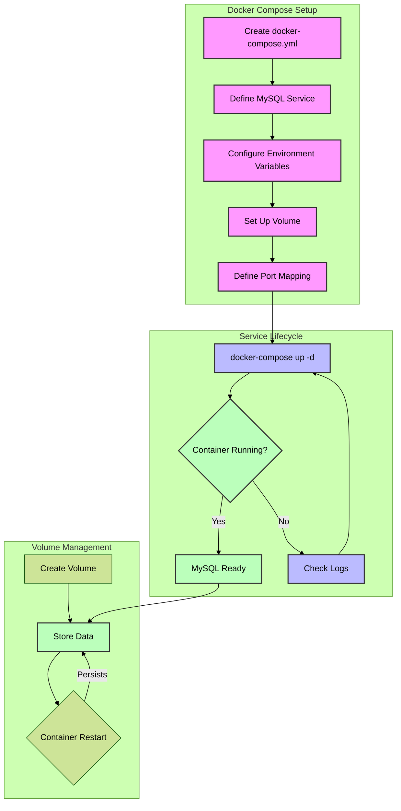

## multi-container application with Docker Compose



```python

import psycopg2
from flask import Flask

app = Flask(__name__)

def connect_db():
    return psycopg2.connect(
        dbname="mydb",
        user="user", 
        password="password",
        host="db"
    )

@app.route("/")
def home():
    try:
        conn = connect_db()
        conn.close()
        return "Connected to DB successfully!"
    except:
        return "DB connection failed!"

if __name__ == "__main__":
    app.run(host="0.0.0.0", port=5000)
```

create requirements.txt
``` 
Flask
psycopg2-binary
```
Create Dockerfile
```

FROM python:3.9
WORKDIR /app
COPY requirements.txt .
RUN pip install -r requirements.txt
COPY . .
CMD ["python", "app.py"]
```


Create docker-compose.yml
```yaml


version: '3.8'
services:
  web:
    build: .
    ports:
      - "5001:5000"  # Changed to 5001 to avoid conflicts
    depends_on:
      - db
  
  db:
    image: postgres
    environment:
      POSTGRES_USER: user
      POSTGRES_PASSWORD: password
      POSTGRES_DB: mydb
    ports:
      - "5432:5432"


      ```


To run the application, use the following command in the terminal:
```bash

# Build and start the containers
docker-compose up --build

# To run in detached mode
docker-compose up --build -d

# To stop the containers
docker-compose down

```
extra commands
```bash

# View logs
docker-compose logs

# View running containers
docker-compose ps

# Rebuild specific service
docker-compose up --build web

# Access PostgreSQL database
docker-compose exec db psql -U user -d mydb
```


