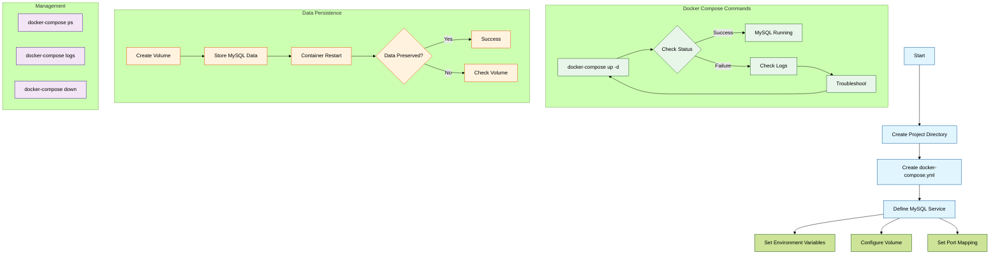

# Persistent Data Storage with Docker Volumes



## Introduction

When working with Docker containers, one critical challenge is data persistence. By default, any data written inside a container is lost when the container is removed. This guide demonstrates how Docker volumes solve this problem, with a practical example showing data preservation.

## Understanding Docker Volumes

Docker volumes provide persistent storage that exists independently of containers. When a container is removed and recreated using the same volume, the data remains intact.

### Key Benefits
- Data persists across container lifecycles
- Efficient data sharing between containers
- Independent backup and restore capabilities

## Practical Example: MySQL with Persistent Storage

### 1. Initial Setup

```bash
# Create a MySQL container with a named volume
docker run -d \
    --name mysql-db \
    -e MYSQL_ROOT_PASSWORD=secretpass \
    -v mysql_data:/var/lib/mysql \
    mysql:8.0
```

### 2. Create Test Data

```bash
# Connect to MySQL
docker exec -it mysql-db mysql -u root -p

# Create and populate test table
CREATE DATABASE testdb;
USE testdb;
CREATE TABLE users (id INT, name VARCHAR(50));
INSERT INTO users VALUES (1, 'Alice');
```

### 3. Test Data Persistence

```bash
# Remove the container
docker rm -f mysql-db

# Create new container with same volume
docker run -d \
    --name mysql-db \
    -e MYSQL_ROOT_PASSWORD=secretpass \
    -v mysql_data:/var/lib/mysql \
    mysql:8.0

# Verify data still exists
docker exec -it mysql-db mysql -u root -p testdb -e "SELECT * FROM users;"
```

## Volume Management

```bash
# List all volumes
docker volume ls

# Inspect volume details
docker volume inspect mysql_data

# Remove unused volumes
docker volume prune
```

## Best Practices
- Use named volumes for easier management
- Implement regular backup strategies
- Label volumes appropriately
- Clean up unused volumes periodically

