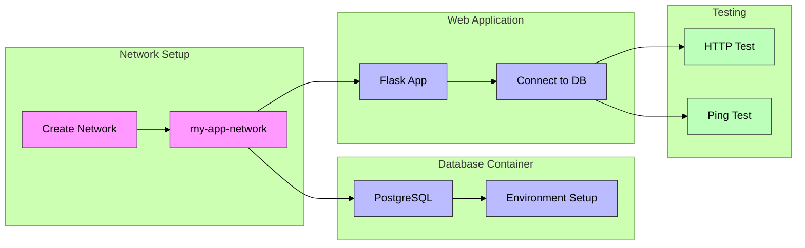

# Docker Networking - Container Communication




## Overview
- **Duration**: 16-18 minutes
- **Topic**: Understanding and implementing Docker container networking

## Introduction (2 minutes)
- Understanding container networking importance
- Default vs custom network configurations
- Real-world application scenarios

## Core Network Concepts (4 minutes)
### Docker Network Types
- Understanding different Docker network types
- Deep dive into bridge networks
- Container name resolution mechanisms

## Hands-On Tutorial (10 minutes)

### 1. Creating a Custom Network (2 minutes)
```bash
docker network create my-app-network
docker network ls
docker network inspect my-app-network
```

### 2. Database Container Setup (2 minutes)
```bash
docker run -d \
    --name app-database \
    --network my-app-network \
    -e POSTGRES_USER=user \
    -e POSTGRES_PASSWORD=password \
    -e POSTGRES_DB=appdb \
    postgres
```

### 3. Web Application Development (3 minutes)
Create `app.py`:
```python
import psycopg2
from flask import Flask

app = Flask(__name__)

@app.route("/")
def home():
        try:
                conn = psycopg2.connect(
                        dbname="appdb",
                        user="user",
                        password="password",
                        host="app-database"  # Container name as hostname
                )
                conn.close()
                return "Connected via custom network!"
        except Exception as e:
                return f"Connection failed: {str(e)}"
```

### 4. Web App Container Deployment (2 minutes)
```bash
docker build -t network-app .
docker run -d \
    --name web-app \
    --network my-app-network \
    -p 5000:5000 \
    network-app
```

### 5. Testing Network Communication (1 minute)
```bash
curl http://localhost:5000
docker exec web-app ping app-database
```

## Conclusion (2 minutes)
- Network isolation advantages
- Common troubleshooting approaches
- Preview of upcoming content


