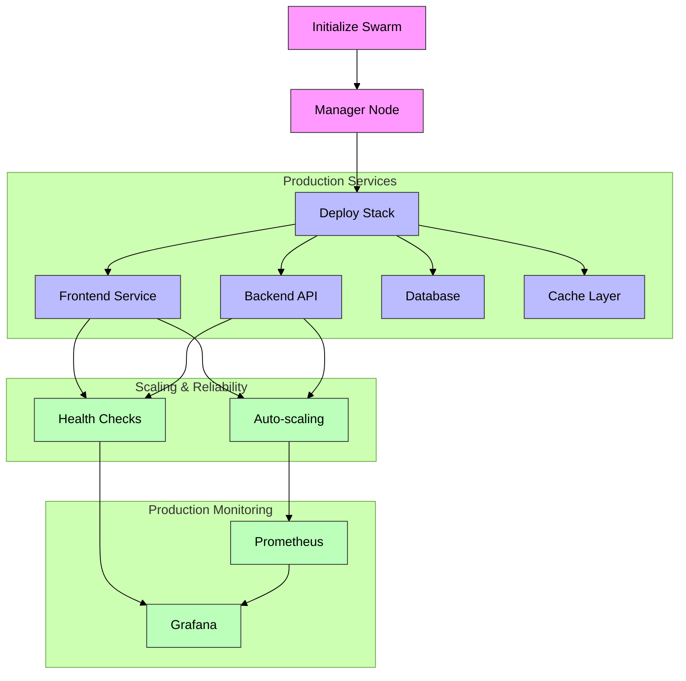

# Docker Swarm: Scaling Applications in Production



This guide demonstrates a production-grade Docker Swarm implementation with real-world scenarios.

## Real-World Use Case: E-Commerce Platform

We'll build a scalable e-commerce platform with:
- Frontend service
- Backend API
- Redis cache
- PostgreSQL database
- Load balancing
- Monitoring

## Production Implementation

### 1. Initialize Production Swarm

```bash
# Initialize with multiple manager nodes for high availability
docker swarm init --advertise-addr <MANAGER-IP>
docker swarm join-token manager  # Add 2 more managers
```

### 2. Production Stack Configuration

Create `docker-compose.yml`:
```yaml
version: '3.8'
services:
  frontend:
    image: nginx:alpine
    ports:
      - "443:443"
    deploy:
      replicas: 3
      update_config:
        parallelism: 1
        delay: 10s
      restart_policy:
        condition: any
    secrets:
      - ssl_cert

  api:
    image: myapp/api:latest
    deploy:
      replicas: 5
      resources:
        limits:
          cpus: '0.5'
          memory: 512M
    environment:
      - REDIS_URL=redis://cache
      - DB_HOST=db

  cache:
    image: redis:alpine
    deploy:
      replicas: 2
      placement:
        constraints: [node.role == worker]

  db:
    image: postgres:13
    deploy:
      placement:
        constraints: [node.labels.db == true]
    volumes:
      - db_data:/var/lib/postgresql/data
    environment:
      POSTGRES_PASSWORD_FILE: /run/secrets/db_password

  prometheus:
    image: prom/prometheus
    ports:
      - "9090:9090"

  grafana:
    image: grafana/grafana
    ports:
      - "3000:3000"

volumes:
  db_data:

secrets:
  ssl_cert:
    external: true
  db_password:
    external: true
```

### 3. Deploy with Zero-Downtime

```bash
# Deploy with rolling updates
docker stack deploy -c docker-compose.yml ecommerce
```

### 4. Production Monitoring

```bash
# Set up Prometheus monitoring
cat > prometheus.yml << EOF
global:
  scrape_interval: 15s
scrape_configs:
  - job_name: 'docker'
    docker_sd_configs:
      - host: unix:///var/run/docker.sock
EOF

# Set up alerts
docker service update --mount-add type=bind,source=./prometheus.yml,target=/etc/prometheus/prometheus.yml ecommerce_prometheus
```

### 5. Auto-scaling Based on Metrics

```bash
# Using Docker's native autoscaling
docker service update --replicas-max 10 \
  --update-monitor 30s \
  --update-monitor-delay 5s \
  ecommerce_api
```

### 6. Health Checks and Logging

```bash
# Configure health checks
docker service update --health-cmd "curl -f http://localhost/health || exit 1" \
  --health-interval 5s \
  --health-retries 3 \
  ecommerce_frontend
```

## Production Considerations

1. **High Availability**
   - Multiple manager nodes
   - Service replica distribution
   - Data persistence strategy

2. **Security**
   - Secret management
   - Network segmentation
   - SSL/TLS configuration

3. **Monitoring & Alerting**
   - Resource utilization
   - Error rates
   - Response times
   - Business metrics

4. **Backup Strategy**
   - Database backups
   - Configuration backups
   - Disaster recovery plan

## Performance Metrics

Monitor these key metrics:
- Request latency: < 100ms
- Error rate: < 0.1%
- Service availability: 99.9%
- Resource utilization: < 80%

