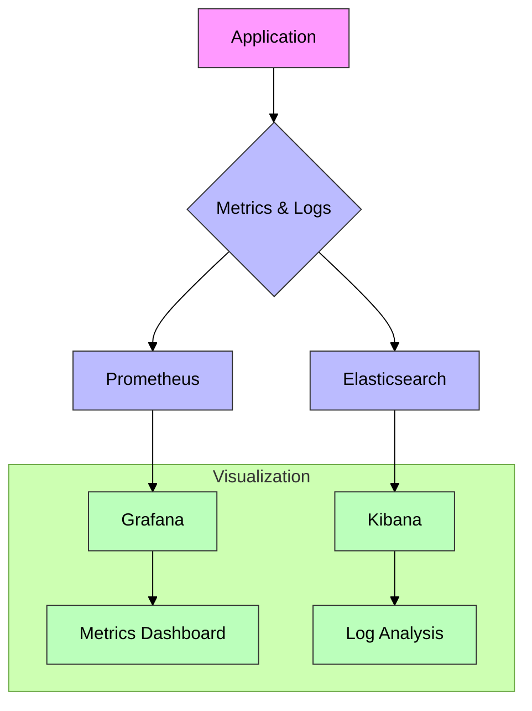

# Day 6: Monitoring and Logging with Docker



This guide explores essential monitoring and logging concepts for Docker containers, demonstrating practical implementation using popular tools.

## Video Overview
**Duration:** 20-22 minutes

### Introduction (2 minutes)
- Importance of monitoring in production environments
- Understanding observability through metrics, logs, and traces
- Introduction to monitoring tools: Prometheus, Grafana, and ELK stack

### Core Concepts (4 minutes)
- Differentiating monitoring and logging approaches
- Understanding Prometheus architecture
- Overview of the ELK (Elasticsearch, Logstash, Kibana) stack

### Hands-On Implementation (14 minutes)

#### 1. Creating a Sample App with Logging (3 minutes)

```python
```python
from flask import Flask, request
import logging
import time
import random
import prometheus_client
from prometheus_client import Counter, Histogram
import structlog

# Initialize Flask
app = Flask(__name__)

# Set up structured logging
logger = structlog.get_logger()

# Initialize Prometheus metrics
REQUESTS = Counter('http_requests_total', 'Total HTTP requests')
LATENCY = Histogram('http_request_duration_seconds', 'Request latency')
ERRORS = Counter('http_errors_total', 'Total HTTP errors')

@app.route("/")
def home():
    REQUESTS.inc()
    logger.info("home_accessed", 
                path="/", 
                method=request.method,
                status=200)
    return "Monitoring Demo App"

@app.route("/slow")
def slow():
    start = time.time()
    time.sleep(random.uniform(0.5, 3))
    latency = time.time() - start
    
    REQUESTS.inc()
    LATENCY.observe(latency)
    
    logger.warning("slow_response", 
                  path="/slow",
                  latency=latency,
                  method=request.method)
    return "Slow response"

@app.route("/error")
def error():
    ERRORS.inc()
    logger.error("error_occurred",
                path="/error",
                error_type="simulation",
                method=request.method)
    return "Error", 500

@app.route("/metrics")
def metrics():
    return prometheus_client.generate_latest()

if __name__ == "__main__":
    app.run(host='0.0.0.0')
```
```

#### 2. Setting Up Docker Compose with Monitoring Stack (6 minutes)

```yaml
version: '3.8'
services:
  web:
    build: .
    ports:
      - "5000:5000"
    
  prometheus:
    image: prom/prometheus
    ports:
      - "9090:9090"
    volumes:
      - ./prometheus.yml:/etc/prometheus/prometheus.yml
  
  grafana:
    image: grafana/grafana
    ports:
      - "3000:3000"
    environment:
      - GF_SECURITY_ADMIN_PASSWORD=admin
  
  elasticsearch:
    image: docker.elastic.co/elasticsearch/elasticsearch:7.17.0
    environment:
      - discovery.type=single-node
    ports:
      - "9200:9200"
  
  kibana:
    image: docker.elastic.co/kibana/kibana:7.17.0
    ports:
      - "5601:5601"
    depends_on:
      - elasticsearch
```

#### 3. Prometheus Configuration (2 minutes)

```yaml
# prometheus.yml
global:
  scrape_interval: 15s

scrape_configs:
  - job_name: 'web-app'
    static_configs:
      - targets: ['web:5000']
```

#### 4. Launching and Testing (3 minutes)

```bash
docker-compose up -d
```

Access dashboard URLs:
- Prometheus: http://localhost:9090
- Grafana: http://localhost:3000
- Kibana: http://localhost:5601

### Conclusion (2 minutes)
- Walkthrough of monitoring dashboards
- Production deployment considerations
- Preview of upcoming content

## Additional Resources
- [Prometheus Documentation](https://prometheus.io/docs/introduction/overview/)
- [Grafana Documentation](https://grafana.com/docs/)
- [ELK Stack Documentation](https://www.elastic.co/guide/index.html)

Prometheus
Role: Metrics collection and storage
What it monitors in our app:
Counts total HTTP requests via REQUESTS counter
Measures response time via LATENCY histogram
Tracks error counts via ERRORS counter
```
# These metrics are exposed at /metrics endpoint
REQUESTS = Counter('http_requests_total', 'Total HTTP requests')
LATENCY = Histogram('http_request_duration_seconds', 'Request latency')
ERRORS = Counter('http_errors_total', 'Total HTTP errors')

```

Elasticsearch & Kibana
Elasticsearch: Stores and indexes structured logs
Kibana: Visualizes the log data
What they monitor in our app:
Structured logs from different endpoints:

```
# Example log entries our app generates
logger.info("home_accessed", path="/", method=request.method)
logger.warning("slow_response", path="/slow", latency=latency)
logger.error("error_occurred", path="/error", error_type="simulation")


Real-life Simulation Aspects
Normal Traffic (/ endpoint)

Simulates regular user visits
Tracked via request counter
Normal response times
Performance Issues (/slow endpoint)

Simulates slow responses (0.5-3 seconds)
Measures latency distribution
Logs warnings for slow responses
Error Scenarios (/error endpoint)

Simulates system failures
Tracks error rates
Generates error logs
Monitoring Flow
App generates metrics and logs
Prometheus scrapes metrics every 15s
Logs are sent to Elasticsearch
Visualization:
Grafana: Shows metrics dashboards (requests, latency, errors)
Kibana: Shows log patterns, error analysis, and trends
This setup mirrors real-world applications where you need to monitor:

Traffic patterns
Response times
Error rates
System health
User behavior

```


