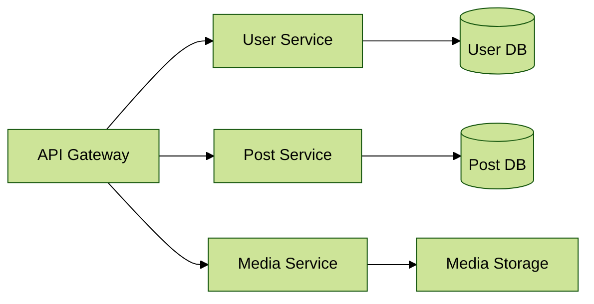

# Secure Docker Deployment with Traefik: Building a Blog Platform with Protected Admin Panel




In this hands-on guide, we'll secure a multi-user blog platform using Docker and Traefik. This is perfect for small businesses or personal bloggers who need a secure way to manage their content.

## Introduction (2 minutes)

When running a blog platform, security is crucial. We'll learn how to:
- Protect the admin dashboard from unauthorized access
- Set up HTTPS encryption for visitor safety
- Implement reverse proxy for better security

## Understanding the Components (4 minutes)

### What is Traefik?
Think of Traefik as your blog's security guard:
- Automatically handles HTTPS certificates
- Manages who can access your admin panel
- Routes visitors to the right pages

### Security Features
- Let's Encrypt for free SSL certificates
- Password protection for admin areas
- Traffic encryption for user data safety

## Hands-On Implementation (12 minutes)

### Step 1: Creating Our Blog Application (2 minutes)
```python
# app.py
```python
from flask import Flask, render_template, request, redirect, jsonify
from flask_sqlalchemy import SQLAlchemy
from datetime import datetime

app = Flask(__name__)
app.config['SQLALCHEMY_DATABASE_URI'] = 'sqlite:///blog.db'
db = SQLAlchemy(app)

class Post(db.Model):
    id = db.Column(db.Integer, primary_key=True)
    title = db.Column(db.String(100), nullable=False)
    content = db.Column(db.Text, nullable=False)
    date_posted = db.Column(db.DateTime, default=datetime.utcnow)

with app.app_context():
    db.create_all()

@app.route("/")
def home():
    posts = Post.query.order_by(Post.date_posted.desc()).all()
    return render_template('home.html', posts=posts)

@app.route("/admin")
def admin():
    posts = Post.query.all()
    return render_template('admin.html', posts=posts)

@app.route("/post/create", methods=['POST'])
def create_post():
    title = request.form.get('title')
    content = request.form.get('content')
    post = Post(title=title, content=content)
    db.session.add(post)
    db.session.commit()
    return render_template('post_row.html', post=post)

@app.route("/post/delete/<int:id>", methods=['DELETE'])
def delete_post(id):
    post = Post.query.get_or_404(id)
    db.session.delete(post)
    db.session.commit()
    return "", 204

@app.route("/post/edit/<int:id>", methods=['GET', 'PUT'])
def edit_post(id):
    post = Post.query.get_or_404(id)
    if request.method == 'PUT':
        post.title = request.form.get('title')
        post.content = request.form.get('content')
        db.session.commit()
        return render_template('post_row.html', post=post)
    return jsonify({'title': post.title, 'content': post.content})

# Templates would be stored in templates/
"""
home.html:
<!DOCTYPE html>
<html>
<head>
    <link href="https://cdn.jsdelivr.net/npm/bootstrap@5.1.3/dist/css/bootstrap.min.css" rel="stylesheet">
    <script src="https://unpkg.com/htmx.org@1.9.0"></script>
</head>
<body>
    <div class="container mt-5">
        <h1>Welcome to Our Blog!</h1>
        <div id="posts">
            
                <div class="card mb-3">
                    <div class="card-body">
                        <h5 class="card-title">{{ post.title }}</h5>
                        <p class="card-text">{{ post.content }}</p>
                        <small>Posted: {{ post.date_posted.strftime('%Y-%m-%d') }}</small>
                    </div>
                </div>
            
        </div>
    </div>
</body>
</html>

admin.html:
<!DOCTYPE html>
<html>
<head>
    <link href="https://cdn.jsdelivr.net/npm/bootstrap@5.1.3/dist/css/bootstrap.min.css" rel="stylesheet">
    <script src="https://unpkg.com/htmx.org@1.9.0"></script>
    <script src="https://cdn.tiny.cloud/1/no-api-key/tinymce/5/tinymce.min.js"></script>
    <script>
        tinymce.init({
            selector: '#content',
            height: 300
        });
    </script>
</head>
<body>
    <div class="container mt-5">
        <h2>Blog Management Dashboard</h2>
        <form hx-post="/post/create" hx-target="#posts" hx-swap="beforeend">
            <input type="text" name="title" class="form-control mb-2" placeholder="Post Title" required>
            <textarea id="content" name="content" class="form-control mb-2" required></textarea>
            <button class="btn btn-primary">Create Post</button>
        </form>
        <div id="posts" class="mt-4">
            
                
            
        </div>
    </div>
</body>
</html>

post_row.html:
<div class="card mb-3" id="post-{{ post.id }}">
    <div class="card-body">
        <h5 class="card-title">{{ post.title }}</h5>
        <p class="card-text">{{ post.content }}</p>
        <small>Posted: {{ post.date_posted.strftime('%Y-%m-%d') }}</small>
        <div class="mt-2">
            <button class="btn btn-sm btn-warning" 
                    hx-get="/post/edit/{{ post.id }}"
                    hx-target="#post-{{ post.id }}"
                    hx-swap="outerHTML">Edit</button>
            <button class="btn btn-sm btn-danger" 
                    hx-delete="/post/delete/{{ post.id }}"
                    hx-target="#post-{{ post.id }}"
                    hx-swap="outerHTML">Delete</button>
        </div>
    </div>
</div>
"""
```
```

### Step 2: Setting Up Security (5 minutes)
```yaml
# docker-compose.yml
# [Previous docker-compose configuration remains the same]
```

### Step 3: Securing Admin Access (2 minutes)
```bash
# Create secure password for admin panel
echo $(htpasswd -nb blogadmin strongpassword123) | sed -e s/\\$/\\$\\$/g
```

### Step 4: Testing Our Setup (3 minutes)
- Deploy the blog platform
- Verify HTTPS is working
- Test admin panel login

## Conclusion (2 minutes)
- Review security measures implemented
- Best practices for blog platform security
- Preview of content management features

> **Note**: Replace `blogadmin` and `strongpassword123` with secure credentials in production.


