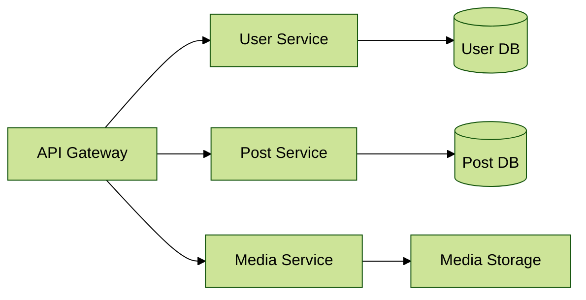

# Building a Social Media Platform with Microservices using Docker & Kubernetes




## Introduction (3 minutes)
In this tutorial, we'll build a simplified version of a social media platform using microservices architecture. We'll create services that handle users, posts, and media content, demonstrating how modern social platforms can be built using containers and Kubernetes.

### Why This Matters
- Real-world example of microservices in action
- Scalable social media architecture
- Industry-standard deployment patterns

## Theory Section (5 minutes)

### Microservices in Social Media
- User Service: Handles authentication and profiles
- Post Service: Manages social media posts
- Media Service: Processes images and videos
- Timeline Service: Aggregates content for user feeds

### Key Concepts
- Service Discovery for inter-service communication
- API Gateway for unified access
- Load balancing for high traffic

## Hands-On Demo (16 minutes)

### Step 1: User Service Implementation (3 minutes)
```python
# user-service/app.py
from flask import Flask, jsonify
app = Flask(__name__)

@app.route("/users")
def get_users():
    return jsonify({
        "users": [
            {"id": 1, "username": "techie_alice", "followers": 1200},
            {"id": 2, "username": "dev_bob", "followers": 850},
            {"id": 3, "username": "coder_charlie", "followers": 2300}
        ]
    })

@app.route("/health")
def health():
    return jsonify({"status": "healthy"})

if __name__ == "__main__":
    app.run(host="0.0.0.0", port=5001)
```

### Step 2: Post Service Implementation (3 minutes)
```python
# post-service/app.py
from flask import Flask, jsonify
app = Flask(__name__)

@app.route("/posts")
def get_posts():
    return jsonify({
        "posts": [
            {"id": 1, "user_id": 1, "content": "Just deployed my first K8s cluster! #tech"},
            {"id": 2, "user_id": 2, "content": "Microservices are amazing! 🚀"},
            {"id": 3, "user_id": 3, "content": "Who's up for a coding challenge?"}
        ]
    })

@app.route("/health")
def health():
    return jsonify({"status": "healthy"})

if __name__ == "__main__":
    app.run(host="0.0.0.0", port=5002)
```

### Step 3: Kubernetes Deployments (5 minutes)
```yaml
# k8s/user-service.yaml
apiVersion: apps/v1
kind: Deployment
metadata:
  name: user-service
spec:
  replicas: 3  # Higher replicas for user service
  selector:
    matchLabels:
      app: user-service
  template:
    metadata:
      labels:
        app: user-service
    spec:
      containers:
      - name: user-service
        image: social-media/user-service:latest
        resources:
          requests:
            memory: "128Mi"
            cpu: "100m"
          limits:
            memory: "256Mi"
            cpu: "200m"
        ports:
        - containerPort: 5001
        livenessProbe:
          httpGet:
            path: /health
            port: 5001
```

### Step 4: API Gateway Configuration (3 minutes)
```yaml
# k8s/ingress.yaml
apiVersion: networking.k8s.io/v1
kind: Ingress
metadata:
  name: social-media-gateway
  annotations:
    nginx.ingress.kubernetes.io/rewrite-target: /
spec:
  rules:
  - host: social.local
    http:
      paths:
      - path: /api/users
        pathType: Prefix
        backend:
          service:
            name: user-service
            port:
              number: 80
      - path: /api/posts
        pathType: Prefix
        backend:
          service:
            name: post-service
            port:
              number: 80
```

### Step 5: Deployment Commands (2 minutes)
```bash
# Start cluster and deploy services
minikube start
kubectl apply -f k8s/
kubectl get pods -w
kubectl get services

# Test the API
curl http://social.local/api/users
curl http://social.local/api/posts
```

## Wrap-up (3 minutes)
- Demonstrated a real social media platform architecture
- Covered scalability with multiple replicas
- Implemented health checks and resource limits
- Next: Adding authentication and real-time features


